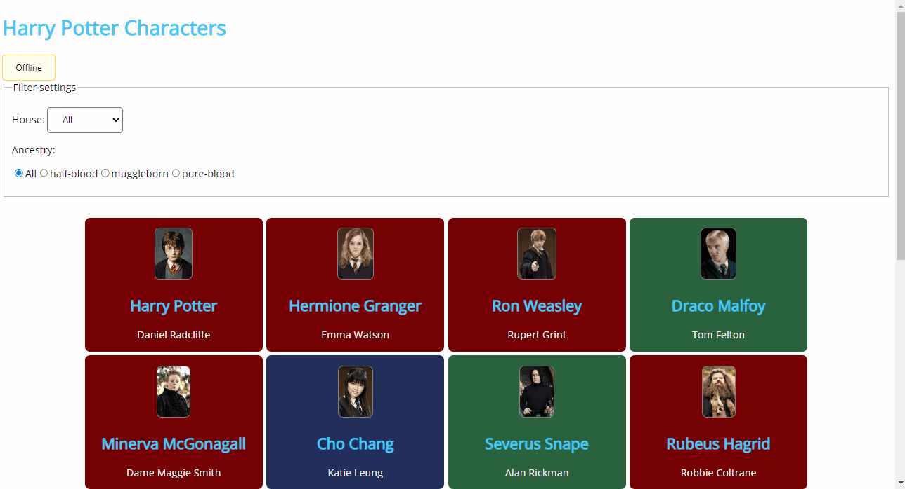

# PE03 - Harry Potter Characters

Maak een applicatie waar in je een lijst weergeeft van een aantal karakters uit Harry Potter op basis van een aangeleverde datafile.

Minimaal weer te geven is:
- een afbeelding van het karakter
- de naam van het karakter
- de naam van de auteur die het karakter speelt (indien van toepassing)

**De karakters vind je in `datafile.js`.**

De applicatie moet het mogelijk maken om te filteren :
- de karakters filteren op basis van hun "house"
- de karakters filteren op basis van hun "bloedlijn" (`ancestry`)

Wanneer de combinatie van de filters geen karakters oplevert wordt dit duidelijk weergegeven in de applicatie.

## Filteren op basis van house
Elk karakter heeft een "house" waartoe het behoort.
Zorg ervoor dat je per house alle karakters weergeeft.
De keuze wordt gemaakt m.b.v. een **select** element.

### Opmerking
De select-lijst wordt dynamisch opgevuld door het script op basis van de data.
Zorg ervoor dat de gebruiker ook alles kan selecteren door een 'All' te voorzien,
en zorg dat de keuzelijst wordt opgevuld met **unieke** namen.

## Filteren op basis van bloedlijn
Voorzie een manier waarop je met behulp van **radio buttons** een keuze kan maken welke karakters getoond worden met een bepaald type bloedlijn.

Zorg ervoor dat de gebruiker ook alles kan selecteren door een 'All' te voorzien, deze zal bij opstarten gekozen worden.

### Opmerking
De radio-buttons wordt dynamisch aangemaakt door het script op basis van de data.Zorg dat de radiobuttons voorzien opgevuld met **unieke** namen.

## Extra data
Bij het hooveren over een afbeelding worden volgende zaken weergegeven.
- Wizard : Geeft aan of het karakter een Wizard is
- Status : Geeft aan of het karakter een student of een stafflid is

## Uitbreiding met een fetch (Online)
In de js-folder vind je een `characters.json` file. Plaats deze file op GitHub Pages en zorg ervoor dat je de data online kan ophalen.

## Extra's
Voorzie een paginering onderaan de pagina in functie van het aantal characters. Is het aantal karakters groter dan 12 dan wordt er paginatie voorzien en worden slechts de eerste 12 karakters getoond. Bij aanklikken van een andere pagina worden enkel de karakters getoond die zich op deze pagina bevinden.

Indien minder dan 12 karakters getoond worden bij filtering verdwijnt de paginatie.

# Voorbeelduitwerking (Zonder extra's)
